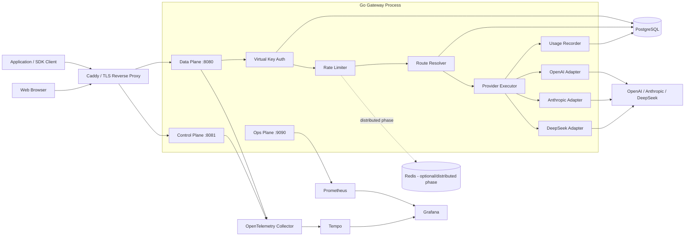

# Technical Design Document: Production Go LLM Gateway MVP

**Status:** Approved Design Baseline  
**Date:** 2026-08-28  
**Target:** 12 weeks / approximately 3 months, quality over deadline  
**Primary Goal:** Build a production-credible, learning-oriented Go LLM Gateway + Web management platform with measurable engineering evidence.

---

## 1. Overview

Production Go LLM Gateway is a backend-first developer infrastructure product that provides:

- one gateway entry point for multiple LLM providers;
- project-scoped virtual API keys;
- encrypted upstream provider credentials;
- streaming/SSE proxying;
- request, token, latency, TTFT, error, retry, and estimated-cost attribution;
- rate limiting and explicitly bounded retry semantics;
- Prometheus metrics, OpenTelemetry traces, Grafana dashboards;
- a small Web management console;
- reproducible integration, failure, race, load, and profiling evidence.

The project is **not** an Agent platform, chatbot, RAG system, billing platform, or generic API gateway clone.

The development philosophy is:

> AI leads implementation; the project owner leads understanding.

Every core module should evolve through:

> simple working version → expose a real limitation → introduce the next mechanism → test failure behavior → explain the mechanism → benchmark where relevant.

---

## 2. Design Goals

### 2.1 Product Goals

1. Support OpenAI, Anthropic, and DeepSeek end-to-end.
2. Attribute every successful test request to project, virtual key, provider credential, provider, and model.
3. Support real HTTP streaming without full-response buffering.
4. Persist request lifecycle, token usage when supplied, and estimated cost.
5. Make failure behavior deliberate and testable.
6. Provide an operational dashboard and a small Web control plane.
7. Produce defensible benchmark and profiling evidence.

### 2.2 Learning Goals

The implementation must create hands-on learning opportunities around:

- Go `net/http`;
- `http.Server`;
- `http.Client` / `http.Transport`;
- connection reuse and pooling;
- contexts, cancellation, deadlines;
- goroutine lifecycle;
- streaming/SSE;
- backpressure;
- PostgreSQL and SQL design;
- Redis and distributed coordination;
- rate limiting;
- retry safety;
- Prometheus;
- OpenTelemetry;
- Docker;
- frontend fundamentals;
- system design;
- benchmarking and `pprof`.

### 2.3 Non-Goals

Not in MVP unless a later benchmark or failure experiment creates a concrete need:

- Kafka;
- Kubernetes;
- microservice decomposition;
- service mesh;
- autonomous agents;
- AI routing;
- complex RBAC;
- billing/invoicing;
- multi-region active-active;
- automatic cross-provider model fallback;
- large provider catalog;
- prompt/response-body retention;
- custom implementations of mature infrastructure primitives merely for feature count.

---

## 3. Recommended Approach

### 3.1 Primary Architecture

**Modular monolith in Go, one process, three HTTP listeners:**

1. **Data Plane** — public LLM traffic.
2. **Control Plane** — authenticated management API.
3. **Operations Plane** — metrics, pprof, internal health/debug endpoints; not publicly exposed.

The code is conceptually separated from day one, but deployment is not split into microservices.

### 3.2 Why This Fits the Project

- Keeps the hot path visible and understandable.
- Avoids hiding HTTP behavior behind a large framework.
- Makes Data Plane vs Control Plane an actual architectural boundary.
- Allows independent HTTP server policies and timeouts.
- Avoids premature service-to-service networking.
- Can later be split into binaries without rewriting core domain packages.
- Leaves enough time for failure testing, profiling, and frontend work.

---

## 4. Major Technical Decisions and Alternatives

| Decision | Recommended | Alternatives | Why |
|---|---|---|---|
| Go HTTP stack | Go 1.27 + `net/http` | Gin; Kratos | Best for learning real HTTP, streaming, cancellation, Transport, and server behavior. Gin/Kratos remain useful references but should not hide the gateway path. |
| Runtime shape | 1 Go process, 3 listeners | 2 Go binaries; microservices | Preserves conceptual separation without deployment overhead. |
| Common LLM API | OpenAI-compatible Chat Completions subset | Responses-first; native-provider-only | Broad cross-provider shape for MVP; provider-specific capability gaps are explicitly rejected/documented instead of silently erased. |
| Provider integration | Direct HTTP adapters | Official SDK per provider; generic SDK | Direct HTTP gives precise control over streaming, headers, errors, retries, and connection lifecycle. |
| PostgreSQL access | `pgx/v5` + `sqlc` | GORM; raw `database/sql` | Keeps SQL explicit while reducing manual scan boilerplate and preserving strong types. |
| Schema migration | `golang-migrate` SQL migrations | Goose; Atlas | Simple, explicit, version-controlled up/down SQL and broad PostgreSQL support. |
| Frontend | React + Vite + TypeScript | Next.js; Go templates | Static SPA keeps backend authority in Go and avoids a second server-side application architecture. |
| UI data fetching | TanStack Query + REST | Redux; GraphQL | Good server-state model with low custom state-management burden. |
| Styling | Tailwind CSS + shadcn/ui | Material UI; custom CSS | Fast infrastructure-console UI without building a design system from scratch. |
| Web authentication | GitHub OAuth + server-side session | Clerk/Auth0; local password auth | Good fit for developer users and avoids password reset/email/security scope. |
| Data Plane authentication | Random virtual API key; non-recoverable hash | JWT; provider key passthrough | Stable project identity, revocation, rotation, attribution, and no provider-secret distribution. |
| Provider-secret storage | AES-256-GCM envelope-style encryption with versioned master key | plaintext env per project; cloud KMS from day one | Recoverable as required, understandable locally, with a clean KMS migration path. |
| Rate limiting | In-memory first, Redis when distributed need is demonstrated | Redis from day one; external service | Creates a real learning progression and keeps Redis non-critical initially. |
| Usage persistence | Create request row before upstream call, finalize after completion | fire-and-forget async queue; Kafka | Prevents starting paid upstream work when the durable request record cannot be created. |
| Metrics | Prometheus client library | all metrics through OTel; SaaS-only | Teaches Prometheus metric design directly and keeps operational metrics simple. |
| Traces | OpenTelemetry → Collector → Tempo | vendor SDK; Jaeger direct | Standard instrumentation boundary; Grafana can correlate metrics and traces. |
| Logs | Go `log/slog` JSON to stdout | Loki from day one; vendor logging | Structured and searchable without adding another MVP dependency. |
| Deployment | Docker Compose on one Linux VM behind Caddy | Kubernetes; serverless/PaaS | Supports long-lived streams and gives realistic ops learning with limited complexity. |

---

## 5. High-Level Architecture



---

## 6. Runtime Topology

### 6.1 Data Plane

Default internal listener: `:8080`

Responsibilities:

- virtual-key authentication;
- request validation;
- model/provider resolution;
- rate limiting;
- request lifecycle creation;
- upstream execution;
- retry orchestration;
- SSE streaming;
- usage/cost finalization;
- request-level tracing and metrics.

Must not contain:

- browser login flows;
- dashboard aggregation endpoints;
- admin CRUD;
- pprof;
- unrestricted debug endpoints.

### 6.2 Control Plane

Default internal listener: `:8081`

Responsibilities:

- GitHub OAuth callback/session handling;
- projects;
- provider credentials;
- virtual API keys;
- request history;
- usage/cost aggregation;
- pricing administration or seed/version visibility;
- audit events;
- links to Grafana/traces.

### 6.3 Operations Plane

Default internal listener: `:9090`

Responsibilities:

- `/metrics`;
- `/health/live`;
- `/health/ready`;
- optional protected `pprof`;
- internal diagnostics.

It is not routed from the public internet in production.

---

## 7. Repository Structure

```text
/
├── cmd/
│   ├── gateway/              # Main production process
│   ├── mockprovider/         # Deterministic upstream for tests/benchmarks
│   └── loadgen/              # Direct-vs-gateway benchmark/load client
├── internal/
│   ├── app/                  # Wiring/lifecycle/graceful shutdown
│   ├── config/
│   ├── dataplane/
│   │   ├── handler/
│   │   ├── auth/
│   │   ├── ratelimit/
│   │   ├── routing/
│   │   ├── executor/
│   │   └── streaming/
│   ├── controlplane/
│   │   ├── handler/
│   │   ├── auth/
│   │   └── service/
│   ├── provider/
│   │   ├── provider.go
│   │   ├── openai/
│   │   ├── anthropic/
│   │   └── deepseek/
│   ├── project/
│   ├── credential/
│   ├── apikey/
│   ├── usage/
│   ├── pricing/
│   ├── store/
│   │   └── postgres/
│   ├── cache/
│   ├── telemetry/
│   └── security/
├── db/
│   ├── migrations/
│   ├── queries/              # sqlc SQL
│   └── sqlc.yaml
├── web/                      # React + Vite + TypeScript
├── deploy/
│   ├── docker/
│   ├── caddy/
│   ├── prometheus/
│   ├── grafana/
│   ├── tempo/
│   └── otel-collector/
├── spec/
├── docs/
│   ├── adr/
│   ├── benchmark/
│   └── runbooks/
├── Makefile
├── docker-compose.yml
├── AGENTS.md
└── README.md
```

Rule: package boundaries should represent actual architectural responsibilities, not one interface per struct.

---

## 8. Public Gateway API

### 8.1 MVP Common Contract

Primary endpoint:

```text
POST /v1/chat/completions
Authorization: Bearer <virtual-api-key>
Content-Type: application/json
```

The API is an **explicitly documented OpenAI-compatible subset**, not a claim of complete OpenAI compatibility.

### 8.2 Model Addressing

MVP model identifiers are namespaced:

```text
openai/<model-id>
anthropic/<model-id>
deepseek/<model-id>
```

Examples are intentionally not hard-coded into routing logic. The model catalog and pricing data are configuration/data.

Reasons:

- provider choice is visible;
- no ambiguous automatic fallback;
- usage attribution is deterministic;
- debugging is easier;
- model aliases/load balancing can be added later.

### 8.3 Compatibility Rule

A request field must be one of:

1. supported and normalized;
2. supported through an explicit provider extension;
3. rejected with a clear `unsupported_parameter` error.

**Never silently discard a meaningful provider-specific field.**

### 8.4 Common Response/Error Headers

```text
X-Gateway-Request-ID
X-Gateway-Provider
X-Gateway-Retry-Count
```

Do not expose provider credentials or internal database identifiers.

### 8.5 Stable Gateway Error Categories

```text
invalid_request
authentication_failed
authorization_failed
rate_limited
provider_not_configured
model_not_supported
provider_rate_limited
provider_timeout
provider_unavailable
provider_invalid_request
stream_interrupted
usage_persistence_failed
internal_error
```

The client-facing envelope should preserve a stable `message`, `type`, and `code`, while internal logs/traces may carry a redacted upstream status/code/request ID.

---

## 9. Control Plane API

Representative REST surface:

```text
GET    /api/v1/me

POST   /api/v1/projects
GET    /api/v1/projects
GET    /api/v1/projects/{projectID}
PATCH  /api/v1/projects/{projectID}

POST   /api/v1/projects/{projectID}/keys
GET    /api/v1/projects/{projectID}/keys
POST   /api/v1/projects/{projectID}/keys/{keyID}/rotate
POST   /api/v1/projects/{projectID}/keys/{keyID}/disable
DELETE /api/v1/projects/{projectID}/keys/{keyID}

POST   /api/v1/projects/{projectID}/provider-credentials
GET    /api/v1/projects/{projectID}/provider-credentials
POST   /api/v1/projects/{projectID}/provider-credentials/{credentialID}/rotate
POST   /api/v1/projects/{projectID}/provider-credentials/{credentialID}/disable

GET    /api/v1/requests
GET    /api/v1/requests/{requestID}
GET    /api/v1/usage/summary
GET    /api/v1/usage/timeseries
GET    /api/v1/usage/breakdown
```

All project-scoped SQL must include ownership authorization at the service/repository boundary. A project ID supplied by the browser is never sufficient authorization.

---

## 10. Provider Abstraction

### 10.1 Principle

The common abstraction exists around the gateway's **business contract**, not around every provider feature.

The provider package should own wire-format differences:

- request translation;
- provider authentication headers;
- response parsing;
- SSE event parsing;
- usage extraction;
- upstream request ID extraction;
- error classification;
- capability validation.

The central executor should own cross-provider policy:

- context/deadline;
- attempt count;
- backoff/jitter;
- stop-retrying rules;
- tracing;
- lifecycle accounting;
- downstream stream state.

### 10.2 Conceptual Interfaces

```go
type Provider interface {
    Name() Name
    Validate(req ChatRequest) error
    BuildRequest(ctx context.Context, req ChatRequest, cred Credential) (*http.Request, error)
    DecodeResponse(resp *http.Response) (ChatResponse, Usage, error)
    NewStream(resp *http.Response) (StreamReader, error)
    Classify(resp *http.Response, err error) ProviderError
}

type StreamReader interface {
    Next() (StreamEvent, error)
    Close() error
}
```

The final code may refine these interfaces, but the boundary must remain:

> executor owns policy; provider adapter owns protocol translation.

### 10.3 Provider-Specific Behavior

Maintain a capabilities matrix in documentation/tests. Examples of capabilities that may differ:

- streaming event shape;
- system/developer message semantics;
- tool-call representation;
- reasoning/thinking controls;
- streaming usage availability;
- finish/stop reason semantics;
- error schema;
- request/version headers.

Do not force a lowest-common-denominator abstraction that pretends these differences do not exist.

---

## 11. Upstream HTTP Client and Connection Management

### 11.1 Transport Lifetime

Create and reuse long-lived `http.Transport` instances.

Do **not** create a new Transport or Client per request.

The Transport configuration must be explicit and benchmarked:

- idle-connection pool;
- max idle connections per host;
- max total connections per host;
- idle connection timeout;
- TLS handshake timeout;
- response header timeout;
- proxy behavior;
- HTTP/2 behavior.

### 11.2 Timeout Model

Avoid relying on a single `http.Client.Timeout` for streaming because it covers the entire request/response lifetime.

Use:

- request context deadline;
- route/provider maximum duration;
- connection/TLS/header timeouts;
- optional per-write deadline to protect against stuck downstream clients.

Data Plane server-wide `WriteTimeout` must not accidentally terminate valid long-running streams. Streaming routes require a timeout policy different from ordinary CRUD routes.

### 11.3 Request Cancellation

The upstream request must derive from the downstream request context.

Flow:

```text
client disconnect
    ↓
r.Context() cancelled
    ↓
upstream HTTP request context cancelled
    ↓
response body closed / read stops
    ↓
handler stops work
    ↓
request lifecycle finalized as cancelled/interrupted
```

Cancellation tests are mandatory.

---

## 12. Streaming / SSE Design

### 12.1 Core Rule

Do not buffer the full model response.

The initial streaming implementation should deliberately avoid multiple goroutines and unbounded channels:

```text
read one upstream event
    ↓
parse/normalize
    ↓
write one downstream event
    ↓
flush
    ↓
read next event
```

This naturally propagates backpressure: a slow downstream write slows upstream consumption.

### 12.2 SSE Parser

Do not depend on the default `bufio.Scanner` token-size limit for arbitrary provider events.

Implement or adopt a bounded SSE decoder that:

- reads line-oriented events safely;
- supports `event:` and `data:` fields;
- handles blank-line event termination;
- allows multiple `data:` lines;
- enforces a configured maximum event size;
- reports malformed events;
- preserves provider event type where needed.

### 12.3 Downstream Flush

After encoding each client-visible event:

- write to `ResponseWriter`;
- flush using the supported HTTP flushing mechanism;
- check write errors;
- stop immediately on cancellation or broken connection.

### 12.4 TTFT Measurement

Record:

```text
request_started_at
upstream_request_started_at
first_client_visible_chunk_at
stream_completed_at
```

Primary TTFT for the product:

```text
TTFT = first_client_visible_chunk_at - request_started_at
```

Benchmark overhead:

```text
gateway_added_TTFT =
    TTFT(client → gateway → mock provider)
  - TTFT(client → mock provider)
```

### 12.5 Errors After Headers Are Sent

Once streaming headers/body have started, the gateway cannot truthfully replace the response with a new HTTP status.

MVP rule:

- mark the durable request as failed/interrupted;
- record trace/log/metric details;
- close the stream when protocol-safe recovery is impossible;
- do not invent a non-standard success chunk pretending the stream completed.

### 12.6 Streaming Usage

Where the provider supplies end-of-stream usage, the adapter extracts it from the provider's final usage-bearing event.

Do not perform local token counting unless a provider-specific tokenizer is explicitly validated. Unknown usage remains nullable and is labeled by `usage_source`.

---

## 13. Request Execution State Machine

Conceptual states:

```text
received
  ↓
authenticated
  ↓
rate_limited_checked
  ↓
request_record_created
  ↓
upstream_attempt_started
  ↓
headers_received
  ↓
stream_started? ── yes ──→ streaming
  ↓ no                      ↓
response_received       stream_finished
  ↓                         ↓
usage_extracted ←────────────┘
  ↓
request_record_finalized
  ↓
completed
```

Terminal failure states include:

```text
rejected
provider_error
timeout
client_cancelled
stream_interrupted
finalization_error
```

This state model should be visible in code/tests rather than hidden in generic middleware.

---

## 14. Retry Semantics

### 14.1 Principle

LLM requests are usually POST requests that may incur provider cost even when the gateway never receives a complete response.

Therefore retries are **not** a generic HTTP middleware.

### 14.2 MVP Rules

Retry only when all are true:

1. error is explicitly classified retryable;
2. no downstream stream bytes have been committed;
3. context deadline leaves enough budget;
4. maximum attempts has not been reached;
5. provider guidance such as `Retry-After` is respected where applicable.

Candidate retryable classes:

- selected connection failures;
- provider 429;
- selected provider 5xx;
- temporary upstream availability errors.

Never retry:

- client validation errors;
- authentication failures;
- clearly non-retryable provider 4xx;
- after streaming has begun;
- after request context cancellation.

### 14.3 Cost Risk

Every retry increments `retry_count` and must be visible in:

- durable request record;
- trace spans;
- metrics.

Documentation must state that a retry can create duplicate upstream cost.

### 14.4 Initial Policy

Start conservatively with a very small bounded attempt count. Tune only after failure tests.

No unlimited retry loops.

---

## 15. Circuit Breaker and Fallback Decision

### 15.1 Circuit Breaker

**Not in the baseline implementation.**

First run controlled provider-failure tests and inspect whether repeated failed calls create meaningful latency/load harm that a circuit breaker solves.

If introduced:

- use a mature Go library;
- define open/half-open semantics;
- expose state in metrics;
- document which error classes count as breaker failures.

### 15.2 Automatic Cross-Provider Fallback

**Explicitly deferred from MVP.**

Reasons:

- models are not semantically interchangeable;
- tools/features differ;
- cost changes;
- quality changes;
- data policy may differ;
- fallback can hide outages and make debugging harder.

A future fallback feature must be explicitly configured per route/model compatibility group.

---

## 16. Rate Limiting Evolution

### Phase A — Single Instance

Use an in-process token bucket keyed by virtual API key or project.

Prefer a mature local limiter such as `x/time/rate` rather than inventing token-bucket math for production code.

Add a separate configurable cap on concurrent active requests/streams where useful.

### Phase B — Demonstrate the Distributed Problem

Run two Gateway instances behind the reverse proxy.

Show:

```text
limit = 10 req/s per key

instance A thinks user used 6
instance B thinks user used 6
actual cluster usage = 12
```

This is the concrete reason to add Redis.

### Phase C — Redis-Backed Distributed Limiter

Use Redis atomic operations/Lua through `go-redis`.

Redis is **not** source of truth for projects, credentials, or durable usage.

### Redis Failure Policy

Do not choose simplistic unlimited fail-open or total fail-closed behavior.

Recommended public-demo behavior:

1. Redis distributed check times out quickly.
2. Emit degraded-mode metric/log.
3. Fall back to a stricter process-local emergency limiter.
4. Continue requests within that emergency bound.

This keeps the product available without turning a Redis outage into unlimited provider spending.

---

## 17. PostgreSQL Design

### 17.1 Source of Truth

PostgreSQL is authoritative for:

- users/sessions;
- projects;
- virtual keys;
- provider credential metadata/ciphertext;
- provider configuration;
- pricing versions;
- durable gateway request records;
- audit events.

### 17.2 Tables

#### `users`

| Column | Type | Notes |
|---|---|---|
| id | UUID PK | internal identity |
| github_id | BIGINT UNIQUE | GitHub user ID |
| github_login | TEXT | display/reference |
| avatar_url | TEXT NULL | UI |
| created_at | TIMESTAMPTZ | |
| updated_at | TIMESTAMPTZ | |

#### `web_sessions`

| Column | Type | Notes |
|---|---|---|
| id | UUID PK | |
| user_id | UUID FK users | |
| token_hash | BYTEA UNIQUE | never store raw cookie token |
| expires_at | TIMESTAMPTZ | |
| created_at | TIMESTAMPTZ | |
| last_seen_at | TIMESTAMPTZ | |

Index: `expires_at`.

#### `projects`

| Column | Type | Notes |
|---|---|---|
| id | UUID PK | |
| owner_user_id | UUID FK users | MVP tenant boundary |
| name | TEXT | |
| slug | TEXT | unique per owner |
| status | TEXT | active/disabled |
| created_at | TIMESTAMPTZ | |
| updated_at | TIMESTAMPTZ | |

Unique index: `(owner_user_id, slug)`.

MVP intentionally uses `user → project` ownership. Team membership/organization RBAC is deferred.

#### `virtual_api_keys`

| Column | Type | Notes |
|---|---|---|
| id | UUID PK | |
| project_id | UUID FK projects | |
| name | TEXT | |
| key_prefix | TEXT | safe display prefix |
| key_hash | BYTEA UNIQUE | HMAC/SHA-style non-recoverable representation |
| status | TEXT | active/disabled/revoked |
| created_at | TIMESTAMPTZ | |
| last_used_at | TIMESTAMPTZ NULL | asynchronously/coarsely updated |
| revoked_at | TIMESTAMPTZ NULL | |

Indexes:

- `(project_id, status)`
- unique `key_hash`

#### `provider_credentials`

| Column | Type | Notes |
|---|---|---|
| id | UUID PK | |
| project_id | UUID FK projects | |
| provider | TEXT | openai/anthropic/deepseek |
| label | TEXT | user-visible |
| secret_ciphertext | BYTEA | AES-GCM ciphertext |
| secret_nonce | BYTEA | random nonce |
| key_version | SMALLINT | encryption-key rotation |
| status | TEXT | active/disabled |
| created_at | TIMESTAMPTZ | |
| rotated_at | TIMESTAMPTZ NULL | |

Index: `(project_id, provider, status)`.

#### `project_provider_configs`

| Column | Type | Notes |
|---|---|---|
| project_id | UUID FK projects | |
| provider | TEXT | |
| credential_id | UUID FK provider_credentials | selected credential |
| enabled | BOOLEAN | |
| base_url_override | TEXT NULL | primarily testing/self-hosted compatibility |
| updated_at | TIMESTAMPTZ | |

Primary key: `(project_id, provider)`.

#### `model_prices`

| Column | Type | Notes |
|---|---|---|
| id | UUID PK | |
| provider | TEXT | |
| model | TEXT | exact/controlled model ID |
| input_nano_usd_per_million | BIGINT | integer money representation |
| output_nano_usd_per_million | BIGINT | |
| effective_from | TIMESTAMPTZ | |
| effective_to | TIMESTAMPTZ NULL | |
| source_note | TEXT | pricing version/reference note |
| created_at | TIMESTAMPTZ | |

Unique index: `(provider, model, effective_from)`.

Pricing is data, not a hard-coded switch statement.

#### `gateway_requests`

| Column | Type | Notes |
|---|---|---|
| id | UUID PK | gateway request ID |
| project_id | UUID FK projects | |
| virtual_key_id | UUID FK virtual_api_keys | |
| provider_credential_id | UUID FK provider_credentials | |
| provider | TEXT | denormalized for analytics |
| model | TEXT | |
| is_stream | BOOLEAN | |
| status | TEXT | lifecycle/final status |
| started_at | TIMESTAMPTZ | |
| first_chunk_at | TIMESTAMPTZ NULL | |
| completed_at | TIMESTAMPTZ NULL | |
| latency_ms | BIGINT NULL | |
| ttft_ms | BIGINT NULL | |
| upstream_http_status | INTEGER NULL | |
| error_category | TEXT NULL | stable gateway category |
| retry_count | SMALLINT | |
| prompt_tokens | BIGINT NULL | |
| completion_tokens | BIGINT NULL | |
| total_tokens | BIGINT NULL | |
| usage_source | TEXT NULL | provider/unavailable/etc. |
| pricing_id | UUID FK model_prices NULL | version used |
| estimated_cost_nano_usd | BIGINT NULL | |
| upstream_request_id | TEXT NULL | safe provider request ID |
| trace_id | TEXT NULL | link to tracing backend |
| created_at | TIMESTAMPTZ | |

Indexes:

- `(project_id, started_at DESC)`
- `(provider, model, started_at DESC)`
- `(status, started_at DESC)`
- `(virtual_key_id, started_at DESC)`

Do not partition this table in MVP. Add partitioning only when measured data volume/query behavior justifies it.

#### `audit_events`

| Column | Type | Notes |
|---|---|---|
| id | UUID PK | |
| actor_user_id | UUID FK users NULL | |
| project_id | UUID FK projects NULL | |
| action | TEXT | key.create, credential.rotate, etc. |
| resource_type | TEXT | |
| resource_id | UUID NULL | |
| metadata | JSONB | non-secret only |
| created_at | TIMESTAMPTZ | |

Index: `(project_id, created_at DESC)`.

---

## 18. Durable Usage Semantics

### 18.1 Why Not Fire-and-Forget

Usage/cost attribution is a core product feature. A pure in-memory async queue can lose records on process crash.

### 18.2 MVP Write Pattern

Before calling a paid upstream provider:

1. authenticate/resolve project;
2. create `gateway_requests` row with `status = in_progress`;
3. only if creation succeeds, begin upstream call.

At completion:

1. extract usage;
2. calculate price using the pricing version effective for the request;
3. update the existing row to final status.

### 18.3 Failure Semantics

If initial request-row creation fails:

- do not call provider;
- return gateway error.

If PostgreSQL fails after the upstream call has already started:

- do not discard already-streamed user output;
- finalization may fail;
- emit a high-severity metric/log/trace event;
- keep the existing `in_progress` record as evidence;
- retry finalization using a bounded in-process retry mechanism if safe;
- never block forever.

A future durable outbox/WAL can be added if benchmark/failure evidence shows this is insufficient.

---

## 19. Cost Calculation

Use integer units to avoid floating-point money errors.

Example conceptual formula:

```text
input_cost_nano_usd =
    prompt_tokens * input_nano_usd_per_million / 1_000_000

output_cost_nano_usd =
    completion_tokens * output_nano_usd_per_million / 1_000_000

estimated_cost =
    input_cost + output_cost
```

Store the `pricing_id` used for each request so historical cost remains reproducible after future price changes.

If usage is unavailable, cost remains null rather than fabricated.

---

## 20. Virtual API Key Security

### 20.1 Key Format

Generate at least 256 bits of cryptographically secure random material.

Human-visible form:

```text
pgw_<prefix>_<secret>
```

The exact encoding should be URL-safe.

### 20.2 Storage

Store:

- safe prefix;
- HMAC-SHA256 or equivalent non-recoverable digest;
- metadata/status.

Never store the full virtual key.

The full key is shown once at creation.

### 20.3 Authentication

Data Plane:

1. parse Bearer token;
2. validate prefix/format;
3. compute digest;
4. look up active key;
5. resolve project/provider configuration;
6. attach auth context to request.

Use constant-time comparison where comparisons occur in process.

---

## 21. Provider Credential Encryption

Provider API secrets must be recoverable because the Gateway uses them upstream.

### MVP Design

- AES-256-GCM;
- random nonce per encryption;
- versioned master key;
- master key provided through deployment secret/environment;
- ciphertext and nonce in PostgreSQL;
- raw secret never logged or returned after creation.

### Rotation

Store `key_version` so a future rotation process can:

1. decrypt with old master key;
2. encrypt with new key;
3. update record;
4. audit the operation.

### Production Upgrade Path

If the public demo becomes long-lived or multi-operator, replace environment-held master key with a cloud KMS/envelope-encryption service without changing domain APIs.

---

## 22. Web Authentication and Authorization

### 22.1 Authentication

Use GitHub OAuth Authorization Code flow for the management console.

After callback:

- upsert local user;
- issue cryptographically random session token;
- store only session-token hash;
- set Secure, HttpOnly, SameSite cookie.

### 22.2 Authorization

MVP tenant rule:

> a user can access only projects whose `owner_user_id` is that user's ID.

The check occurs in backend services/queries, not only in frontend routing.

### 22.3 CSRF/CORS

- keep Web UI and Control Plane same-origin in production;
- do not enable broad CORS;
- use SameSite cookie plus Origin/CSRF checks for mutating requests;
- Gateway Data Plane uses Bearer keys and is independent of browser sessions.

---

## 23. Logging and Redaction

Use `log/slog` with JSON output in production.

Recommended fields:

```text
timestamp
level
message
gateway_request_id
trace_id
project_id
virtual_key_prefix
provider
model
stream
status
latency_ms
ttft_ms
retry_count
error_category
upstream_status
```

Never log:

- Authorization headers;
- cookies;
- raw virtual API keys;
- raw provider keys;
- encryption master key;
- prompt bodies;
- response bodies;
- full upstream error bodies without sanitization.

High-cardinality request IDs belong in logs/traces, not Prometheus labels.

---

## 24. Metrics

Use Prometheus-compatible metrics with deliberately bounded label sets.

### 24.1 Core Metrics

Counters:

```text
gateway_requests_total{provider,model_family,status,stream}
gateway_retries_total{provider,reason}
gateway_provider_errors_total{provider,category}
gateway_tokens_total{provider,direction}
gateway_cost_nano_usd_total{provider}
gateway_rate_limit_rejections_total{scope}
gateway_usage_finalization_failures_total{}
```

Histograms:

```text
gateway_request_duration_seconds{provider,stream}
gateway_ttft_seconds{provider}
gateway_upstream_duration_seconds{provider}
gateway_usage_finalize_duration_seconds{}
```

Gauges:

```text
gateway_active_requests{}
gateway_active_streams{provider}
gateway_degraded_dependency{dependency}
```

### 24.2 Label Rules

Do not label Prometheus metrics with:

- request ID;
- trace ID;
- raw project ID;
- user ID;
- virtual key ID.

Provider and carefully bounded model-family labels are acceptable; exact arbitrary model strings should be reviewed for cardinality.

---

## 25. OpenTelemetry Tracing

Trace hierarchy:

```text
gateway.request
├── auth.virtual_key
├── rate_limit.check
├── usage.create_request_record
├── provider.attempt
│   ├── provider.http
│   └── provider.stream
└── usage.finalize
```

Useful span attributes:

```text
gateway.request_id
llm.provider
llm.model
llm.stream
gateway.retry_attempt
http.response.status_code
gateway.error_category
```

Avoid prompt/response contents in span attributes.

### Backend

```text
Go app → OTLP → OpenTelemetry Collector → Tempo → Grafana
```

Logs remain `slog` stdout in MVP; do not force OTel logging while its ecosystem is less mature than traces/metrics.

---

## 26. Frontend Architecture

### 26.1 Stack

- React;
- Vite;
- TypeScript;
- React Router;
- TanStack Query;
- Tailwind CSS;
- shadcn/ui;
- a lightweight chart library only where needed.

### 26.2 Why Not Next.js

The dashboard is an authenticated infrastructure console, not an SEO/content product.

React + Vite:

- keeps server logic in Go;
- is easier to mentally separate from backend architecture;
- can be built to static assets;
- avoids Node server runtime in production;
- still teaches modern frontend fundamentals.

### 26.3 Screens

1. Overview
2. Projects
3. Virtual API Keys
4. Provider Credentials
5. Usage & Cost
6. Requests
7. Observability

### 26.4 Data Rules

- pagination is server-side;
- aggregates are computed server-side;
- raw prompt/response bodies are not requested because they are not stored;
- provider secret is never returned after creation;
- full virtual key is only shown in the creation response.

---

## 27. Local Development

### 27.1 Required Tools

- Go 1.27 toolchain;
- Docker + Docker Compose;
- Node.js LTS + npm;
- PostgreSQL client optional;
- Make.

### 27.2 Local Services

Docker Compose starts:

- PostgreSQL;
- Redis when the Redis milestone is enabled;
- OpenTelemetry Collector;
- Prometheus;
- Tempo;
- Grafana.

During early development, Go and Vite may run on the host for fast iteration.

### 27.3 Standard Commands

Repository `Makefile` must provide:

```bash
make bootstrap
make dev
make test
make typecheck
make lint
make build
make integration
make race
make bench
```

These become the commands Coding Agents are required to run rather than inventing their own workflow.

---

## 28. Deployment

### 28.1 Public Demo Baseline

One Linux VM:

```text
Internet
   ↓
Caddy :443
   ├── api.example     → Go Data Plane :8080
   └── console.example → static React assets + Go Control Plane :8081

private Docker network:
   Go app
   PostgreSQL or external managed PostgreSQL
   Redis if enabled
   OTel Collector
   Prometheus
   Tempo
   Grafana
```

### 28.2 PostgreSQL Deployment Choice

Development:

- self-host PostgreSQL in Docker.

Public demo recommendation:

- use managed PostgreSQL if its backup/TLS/operational benefits justify the cost;
- otherwise self-host with persistent volume, automated backups, restore test, and firewall restrictions.

This is one of the few areas where managed infrastructure can provide real engineering value rather than resume decoration.

### 28.3 TLS

Caddy terminates public TLS.

Internal services are not exposed directly to the internet.

### 28.4 Secrets

Production secrets must not live in the repository.

Expected environment/secrets include:

```text
DATABASE_URL
DATA_PLANE_ADDR
CONTROL_PLANE_ADDR
OPS_ADDR
PUBLIC_CONSOLE_URL
GITHUB_CLIENT_ID
GITHUB_CLIENT_SECRET
SESSION_TOKEN_PEPPER
VIRTUAL_KEY_PEPPER
CREDENTIAL_MASTER_KEY
OTEL_EXPORTER_OTLP_ENDPOINT
REDIS_URL                  # only when enabled
LOG_LEVEL
```

Provider API credentials are normally entered through the Web control plane and stored encrypted, not configured as shared environment variables.

---

## 29. Readiness and Graceful Shutdown

### `/health/live`

Checks only that the process/event loop is alive.

### `/health/ready`

Checks critical dependencies required before accepting new paid requests:

- PostgreSQL connectivity;
- required configuration/encryption key loaded.

Redis is not a hard readiness dependency when local degraded limiting is available.

External LLM provider availability should not make the entire Gateway unready. Provider health is an operational signal, not global process readiness.

### Shutdown

On SIGTERM/SIGINT:

1. stop accepting new requests;
2. gracefully shut Control Plane;
3. allow in-flight Data Plane requests/streams a bounded drain period;
4. cancel remaining work;
5. flush telemetry where possible;
6. close PostgreSQL/Redis/idle HTTP connections.

Test shutdown with active streams.

---

## 30. Testing Strategy

### 30.1 Unit Tests

Cover pure logic:

- request validation;
- provider model parsing;
- error classification;
- retry decision function;
- price calculation;
- virtual-key hashing/validation;
- credential encryption/decryption;
- rate-limit policy;
- stream event normalization.

### 30.2 HTTP/Provider Integration Tests

Use `httptest.Server` as fake upstream providers.

Scenarios:

- normal JSON response;
- valid SSE;
- delayed first event;
- slow chunks;
- malformed SSE;
- 429 + Retry-After;
- 500/502/503;
- connection reset;
- upstream closes mid-stream;
- error after downstream headers;
- client cancellation;
- downstream slow consumer.

### 30.3 PostgreSQL Integration

Use real PostgreSQL, preferably isolated with Testcontainers or CI service containers.

Test:

- migrations from empty DB;
- project ownership;
- key create/revoke;
- encrypted credential persistence;
- request create/finalize;
- aggregation queries;
- transaction behavior;
- DB unavailable.

### 30.4 Redis Integration

Only after Redis milestone:

- distributed limit across two Gateway instances;
- atomic token-bucket behavior;
- Redis timeout;
- Redis unavailable;
- local emergency limiter fallback.

### 30.5 End-to-End Provider Smoke Tests

Real provider tests are:

- opt-in;
- secret-gated;
- low volume;
- excluded from normal PR test runs if they incur cost;
- run manually or on a controlled schedule.

### 30.6 Race Testing

Required:

```bash
go test -race ./...
```

Also run race-enabled targeted streaming/cancellation tests.

---

## 31. Deterministic Mock Provider

`cmd/mockprovider` is a first-class engineering tool, not test boilerplate.

It should support configurable:

- HTTP status;
- header delay;
- first-token delay;
- number of chunks;
- interval between chunks;
- chunk size;
- usage-at-end;
- abrupt disconnect;
- malformed event;
- connection reset;
- fixed non-stream response.

This gives a controlled baseline independent of real model latency and cost.

---

## 32. Benchmark and Profiling Plan

### 32.1 Benchmark Principle

Never benchmark only:

```text
Client → Gateway → real LLM
```

because provider latency dominates and varies.

Compare:

```text
A. Client → Mock Provider
B. Client → Gateway → Mock Provider
```

under the same workload.

### 32.2 Required Measurements

For streaming and non-streaming:

- P50 latency;
- P95 latency;
- P99 latency;
- TTFT;
- gateway-added latency;
- gateway-added TTFT;
- throughput;
- concurrent streams;
- error rate;
- CPU;
- heap;
- allocations;
- goroutine count;
- open/reused upstream connections where observable.

### 32.3 Profiles

Capture:

- CPU profile;
- heap profile;
- allocation profile;
- goroutine profile;
- mutex/block profile when contention is suspected.

### 32.4 Methodology Rules

Every published benchmark records:

- Go version;
- commit SHA;
- hardware/VM;
- OS;
- mock-provider configuration;
- request size;
- concurrency;
- duration;
- warmup;
- streaming/non-streaming mode;
- Transport configuration;
- number of repetitions.

Final resume numbers are written only after measurement.

---

## 33. CI/CD

Recommended Git workflow: **GitHub Flow**.

Every significant feature:

```text
feature branch
  ↓
pull request
  ↓
tests/review
  ↓
merge to main
```

### CI Checks

Backend:

```text
gofmt check
go vet ./...
go test ./...
go test -race ./...
govulncheck ./...
sqlc generate + clean-diff check
migration validation
```

Frontend:

```text
npm ci
npm run lint
npm run typecheck
npm test
npm run build
```

Integration:

- PostgreSQL service/container;
- Redis only where tests require it;
- mock-provider failure suite.

Main branch:

- build immutable Docker image;
- deploy public demo through an explicit deployment workflow;
- migrations run as a documented release step.

No production deployment should be performed by an unrestricted Coding Agent without human review.

---

## 34. AI-Assisted Development Workflow

### 34.1 Operating Model

Default: **Spec-first AI implementation**.

Critical modules: **small-step implementation + explanation gate**.

### 34.2 AI May Implement

- CRUD scaffolding;
- SQL binding boilerplate;
- frontend tables/forms;
- tests from accepted cases;
- Docker/config boilerplate;
- repetitive adapters after the first one is understood.

### 34.3 Critical Modules Require Small Steps

- `http.Transport`;
- SSE parser;
- downstream flushing;
- context cancellation;
- retry state machine;
- distributed rate limit;
- request lifecycle durability;
- security primitives;
- OTel instrumentation;
- load generation/benchmarking.

### 34.4 Required Loop Per Milestone

```text
1. Define the problem
2. Explain the simplest design
3. Update spec/ADR
4. Give Coding Agent bounded task
5. Agent implements
6. Run tests
7. Code review
8. Explain code path
9. Run failure experiment
10. Answer learning questions
11. Continue only after understanding
```

### 34.5 Coding-Agent Constraints

Agent must not silently:

- add infrastructure;
- change schema;
- change architecture;
- add a dependency;
- change encryption/key format;
- alter public API contract;
- enable prompt logging;
- weaken auth;
- change deployment topology.

Those changes require an ADR or explicit human approval.

---

## 35. 12-Week Implementation Roadmap

### Week 1 — HTTP Foundation and Architecture

Build:

- Go 1.27 project baseline;
- three `http.Server`s;
- graceful shutdown;
- config loading;
- PostgreSQL container;
- migration tool;
- health endpoints;
- structured logging;
- first architecture ADR.

Learn:

- server vs mux vs handler;
- request lifecycle;
- context;
- graceful shutdown;
- connection/server timeouts.

Acceptance gate:

- process starts/stops cleanly;
- readiness depends on PostgreSQL;
- tests cover shutdown/basic routing.

### Week 2 — Control Plane Core

Build:

- GitHub OAuth;
- users/sessions;
- projects;
- virtual API key creation/list/disable/revoke;
- provider credential encrypted CRUD;
- minimal React shell.

Learn:

- sessions/cookies;
- hashing vs encryption;
- PostgreSQL indexes/FKs;
- transaction boundaries.

### Week 3 — First Provider, Non-Streaming

Build:

- OpenAI adapter;
- `/v1/chat/completions` non-stream path;
- virtual-key auth;
- request row create/finalize;
- stable error envelope;
- mock provider.

Learn:

- `http.Client`;
- `RoundTripper`;
- request/response bodies;
- connection reuse.

### Week 4 — Streaming Core

Build:

- SSE parser;
- streaming proxy;
- flush;
- TTFT;
- client cancellation propagation;
- slow-consumer behavior;
- streaming failure tests.

Learn deeply:

- SSE framing;
- buffering;
- backpressure;
- ResponseWriter;
- context cancellation;
- why a stream cannot simply be retried.

### Week 5 — Provider Abstraction + DeepSeek

Build:

- extract common provider interface;
- DeepSeek adapter;
- capability validation;
- provider/model namespacing;
- cross-provider tests.

Learning goal:

- understand what is genuinely common vs provider-specific.

### Week 6 — Anthropic Adapter

Build:

- Anthropic Messages translation;
- named SSE event parsing;
- stop/error mapping;
- token usage extraction where supplied.

Acceptance:

- all three providers pass common end-to-end contract tests;
- provider differences documented.

### Week 7 — Usage, Cost, and Dashboard

Build:

- pricing version table;
- estimated-cost calculation;
- request history;
- usage/time-series aggregation;
- Overview / Usage / Requests UI.

Learn:

- SQL aggregation;
- indexes;
- integer money units;
- pagination.

### Week 8 — Reliability Baseline

Build:

- in-memory token-bucket limiter;
- concurrent-request/stream bound;
- bounded retry orchestration;
- Retry-After handling;
- timeout/failure matrix.

Explicit decision review:

- is a circuit breaker justified yet?

### Week 9 — Redis as a Demonstrated Distributed Need

Experiment:

- run two Gateway replicas;
- prove local rate-limit inconsistency.

Then implement:

- Redis distributed rate limit;
- degraded local emergency limiter;
- Redis failure tests.

Learn:

- shared state;
- atomicity;
- source of truth;
- fail-open/fail-closed trade-offs.

### Week 10 — Observability

Build:

- Prometheus metrics;
- OTel traces;
- Collector;
- Tempo;
- Grafana dashboard;
- trace links from request UI;
- protected pprof.

Learn:

- logs vs metrics vs traces;
- metric cardinality;
- spans;
- scrape vs push/export.

### Week 11 — Performance Engineering

Build:

- load generator;
- benchmark scenarios;
- direct-vs-gateway baseline;
- pprof captures.

Tune only from evidence:

- Transport pools;
- allocations;
- buffering;
- SQL hot path;
- concurrency limits.

Produce first benchmark report.

### Week 12 — Public Demo and Portfolio Hardening

Build/finalize:

- Caddy/TLS;
- production Compose;
- backup/restore procedure;
- security review;
- CI/CD;
- public demo;
- README;
- architecture diagrams;
- failure semantics;
- benchmark report;
- screenshots;
- final ADR list.

Final gate:

- resume claims map to repeatable commands and evidence.

---

## 36. Architecture Decision Records to Maintain

Minimum ADR set:

```text
ADR-001 modular monolith and three listeners
ADR-002 net/http instead of Gin/Kratos for Data Plane
ADR-003 OpenAI-compatible Chat Completions subset
ADR-004 direct provider HTTP adapters
ADR-005 PostgreSQL as source of truth
ADR-006 virtual-key hash strategy
ADR-007 provider credential encryption
ADR-008 request create/finalize durability model
ADR-009 retry semantics and duplicate-cost risk
ADR-010 in-memory → Redis distributed limiting
ADR-011 no automatic provider fallback in MVP
ADR-012 Prometheus metrics + OTel traces
ADR-013 React/Vite management console
ADR-014 Docker Compose public deployment
ADR-015 benchmark methodology
```

An ADR should answer:

1. context/problem;
2. options;
3. decision;
4. consequences;
5. how to revisit the decision.

---

## 37. Failure Matrix

| Failure | Expected Behavior |
|---|---|
| Invalid virtual key | reject before provider call |
| Disabled/revoked key | reject before provider call |
| PostgreSQL unavailable during auth/request creation | fail request; do not start paid upstream call |
| Provider credential decrypt failure | fail request; security/error metric |
| Provider 429 before stream | bounded retry only if policy allows; respect provider hint |
| Provider 5xx before stream | classified bounded retry |
| Provider timeout | cancel attempt; finalize timeout |
| Client disconnect | cancel upstream promptly |
| Provider disconnect mid-stream | stop stream; finalize interrupted; no retry |
| Slow client | backpressure; no unbounded queue |
| PostgreSQL fails during finalization | keep prior in-progress row; emit critical telemetry; bounded finalize retry |
| Redis unavailable | local emergency limiter; degraded metric |
| OTel backend unavailable | request continues; telemetry export failure must not break data path |
| Prometheus unavailable | scrape fails externally; data path unaffected |
| Grafana unavailable | data path unaffected |
| Web frontend unavailable | Data Plane continues operating |

---

## 38. Security Checklist

- TLS for all public traffic.
- Provider secrets encrypted at rest.
- Virtual keys non-recoverable.
- Full virtual key shown once.
- Authorization/cookies/secrets redacted.
- Prompt/response body retention disabled.
- Same-origin Control Plane.
- CSRF/origin protections.
- Project ownership enforced in backend queries.
- No public pprof.
- Ops listener private.
- Request-body size limit.
- Reasonable header limits/timeouts.
- Dependency vulnerability checks.
- Audit sensitive configuration changes.
- Public demo uses test/limited provider credentials and spending limits where available.

---

## 39. Scaling Path

### Current MVP

- one Go process;
- one PostgreSQL primary;
- optional Redis;
- one deployment region;
- no queue;
- no microservices.

### Add Only When Triggered by Evidence

**In-memory config/key cache**  
Trigger: PostgreSQL auth/config lookup appears materially in benchmark/DB load.

**Async/durable usage pipeline**  
Trigger: finalization writes materially affect throughput/latency or recovery requirements exceed the create/finalize design.

**Kafka/message bus**  
Trigger: durable event throughput/consumer fan-out cannot be met cleanly by PostgreSQL/outbox.

**Separate Data/Control binaries**  
Trigger: independent scaling/security/deployment cadence becomes valuable.

**Kubernetes**  
Trigger: multiple services/replicas and operational needs make manual Compose deployment the bottleneck.

**Partitioned request table**  
Trigger: measured table/index size and retention queries require it.

---

## 40. Open Questions to Resolve During Implementation

These are deliberate implementation-time decisions, not missing product requirements:

1. Exact initial common request-field subset for `/v1/chat/completions`.
2. Exact per-provider timeout defaults after integration testing.
3. Maximum allowed request/SSE event sizes.
4. Whether request authorization/config lookup needs in-memory caching after benchmark.
5. Whether circuit breaker is justified after Week 8 failure experiments.
6. Whether Redis remains only a learning/distributed-test feature or is enabled in the public demo.
7. Managed vs self-hosted PostgreSQL for the final public demo.
8. Exact public domain/hosting vendor.
9. Data retention window for request metadata in the public demo.
10. Whether a native OpenAI Responses endpoint becomes a post-MVP extension.

Unknown numeric performance targets remain TBD until baseline measurement; they must not be invented in advance.

---

## 41. Current External Validation Notes

As of 2026-08-28:

- Go 1.27 is the current Go release selected for this project.
- Go HTTP Transports are designed to be reused and are safe for concurrent use.
- OpenAI supports streaming through SSE and recommends its Responses API for new OpenAI-native projects, while Chat Completions remains available.
- Anthropic's Messages API streams named SSE events and has different event semantics from OpenAI-style data-only streams.
- DeepSeek exposes OpenAI-compatible Chat Completions and streaming semantics, while provider/model capabilities still vary.
- OpenTelemetry Go traces and metrics are stable; logs are less mature and are not required for this MVP.
- Prometheus label cardinality must be deliberately controlled.

Provider API behavior and model/pricing catalogs are fast-moving. Provider contract tests and pricing/version data must be maintained as code/data rather than assumed permanently stable.

---

## 42. Definition of Technical Success

The MVP is technically successful when:

- [ ] OpenAI, Anthropic, and DeepSeek work through the Gateway.
- [ ] virtual-key auth is revocable and attributable.
- [ ] provider credentials are recoverably encrypted.
- [ ] streaming does not intentionally buffer the full response.
- [ ] cancellation propagates upstream.
- [ ] request lifecycle is durably created before paid upstream execution.
- [ ] successful E2E requests finalize attributable usage records.
- [ ] usage/cost aggregation is visible in the Web dashboard.
- [ ] bounded retry rules are tested.
- [ ] no retry occurs after streaming begins.
- [ ] rate limiting exists.
- [ ] Redis behavior is explicitly justified/tested if enabled.
- [ ] Prometheus metrics are available.
- [ ] OpenTelemetry traces are available.
- [ ] Grafana shows operational state.
- [ ] PostgreSQL/provider/stream failure tests exist.
- [ ] `go test -race` passes.
- [ ] direct-vs-gateway benchmarks are reproducible.
- [ ] `pprof` evidence is captured.
- [ ] public demo is reproducibly deployed.
- [ ] no raw provider key/full virtual key/prompt body is intentionally logged.
- [ ] the project owner can explain every major ADR without relying on generated code.

---

## 43. Learning Gate

A milestone is not "done" merely because tests pass.

For each core milestone, the project owner should be able to answer:

1. What problem did this mechanism solve?
2. What was the simpler version?
3. Why was the simpler version insufficient?
4. What happens when this dependency fails?
5. How does `context.Context` affect this path?
6. What resource can leak here?
7. What metric/trace proves the behavior?
8. How would this change with two Gateway instances?
9. What trade-off did we accept?
10. What evidence would make us redesign it?

This is part of the product's Definition of Done.

---

## 44. Self-Verification Checklist

| Required Section | Present? |
|---|---|
| Platform/approach clearly chosen | Yes |
| Alternatives compared with pros/cons | Yes |
| Tech stack fully specified | Yes |
| Trade-offs acknowledged | Yes |
| Budget philosophy included | Yes |
| 12-week timeline included | Yes |
| AI assistance strategy defined | Yes |
| Data Plane / Control Plane defined | Yes |
| Database schema defined | Yes |
| Security model defined | Yes |
| Streaming/failure semantics defined | Yes |
| Observability design defined | Yes |
| Benchmark/profiling plan defined | Yes |

---

## Handoff Context
<!-- Machine-readable summary for the next workflow step. Do not delete; the next prompt in the workflow reads this block. -->
- Stage: techdesign
- App name: Production Go LLM Gateway
- User level: C
- Target platform: Web management console + Go backend LLM Gateway
- Budget: Flexible; local/self-host first, pay only for clear engineering value
- Timeline: Approximately 12 weeks / 3 months; quality over deadline; 20+ hours/week
- Chosen stack: React + Vite + TypeScript frontend; Go 1.27 net/http modular monolith; PostgreSQL + pgx/v5 + sqlc + golang-migrate; optional Redis; Prometheus + OpenTelemetry + Tempo + Grafana; Docker Compose + Caddy
- AI coding tool: Tool-agnostic Coding Agent workflow governed by AGENTS.md/spec/ADR; AI leads implementation, human leads understanding and approval
- Source files: research-Production-Go-LLM-Gateway.md → PRD-Production-Go-LLM-Gateway-MVP.md → TechDesign-Production-Go-LLM-Gateway-MVP.md

---

```json
{
  "appName": "Production Go LLM Gateway",
  "stack": {
    "frontend": "React + Vite + TypeScript",
    "backend": "Go 1.27 net/http modular monolith with separate Data, Control, and Ops listeners",
    "database": "PostgreSQL + pgx/v5 + sqlc + golang-migrate",
    "auth": "GitHub OAuth 2.0 + server-side Web sessions; hashed virtual API keys for Data Plane",
    "styling": "Tailwind CSS + shadcn/ui",
    "deployment": "Docker Compose on a single Linux VM behind Caddy; managed PostgreSQL optional for public demo"
  },
  "commands": {
    "setup": "make bootstrap",
    "dev": "make dev",
    "test": "make test",
    "typecheck": "make typecheck",
    "lint": "make lint",
    "build": "make build"
  },
  "aiScope": "development automation only; no autonomous in-product AI"
}
```
