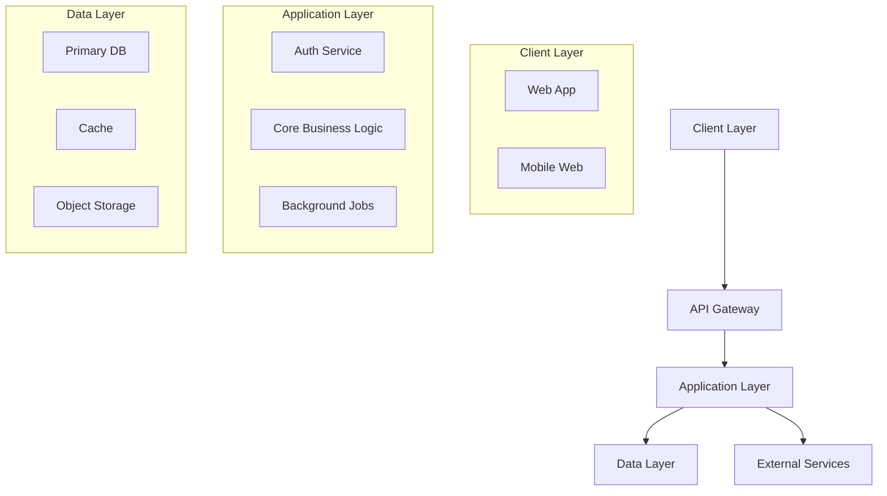

# Part 3 — Technical Design Document Generator

I'll help you create a Technical Design Document for your MVP. This document will define HOW to build what you outlined in your PRD using modern tools and best practices.

<details>
<summary><b>Before We Start — Required Documents</b></summary>

### Required Files:
1. **PRD Document** (from Part 2) — Required
2. **Research Findings** (from Part 1) — Optional but helpful

Please attach these as:
- `.txt`, `.pdf`, `.docx`, or `.md` files
- Or paste the content directly if short

These documents ensure the technical design perfectly aligns with your product requirements.

</details>

Once you've attached the file(s), please confirm your technical level:
- A) **Vibe-coder** — Limited coding, using AI to build everything
- B) **Developer** — Experienced programmer
- C) **Somewhere in between** — Some basics, still learning

Please attach your PRD (and optionally your research) and type A, B, or C:

---

## Instructions for AI Assistant

<details>
<summary><b>Best AI Platforms for Technical Design</b></summary>

### Platform Guidance
Use the assistant that can reason through trade-offs, cite current official docs, and keep the output structured. Claude, ChatGPT, Gemini, Codex, Cursor, Copilot, and Antigravity/Gemini-compatible agents can all fit different parts of the work.

### Choosing the Right Tool
| Need | Selection Criteria |
|------|--------------------|
| Architecture design | Gives alternatives, trade-offs, and failure modes |
| Current vendor docs | Can verify official docs for tool/API/deployment claims |
| Repo-grounded implementation | Can read files, run checks, and preserve existing patterns |
| Long-context synthesis | Keeps PRD/research constraints intact without dropping scope |

**Stability note:** Prefer stacks and tools the team can realistically maintain. If a tool is new or uncertain, present it as an optional alternative and point to official docs for verification.

**Continuity note:** Keep technical design in the same project conversation where possible. If the session gets too long, summarize/compact instead of opening an empty thread.

</details>

Wait for the user to attach their PRD document. Read it thoroughly to understand:
- Product name and core purpose
- Must-have features
- Target users and their technical level
- UI/UX requirements
- Budget and timeline constraints
- Any technical preferences mentioned

If research is also provided, scan for:
- Competitor tech stacks
- Recommended tools from research
- Cost considerations
- Technical complexity insights

Then ask these questions ONE AT A TIME based on their technical level:

### Path A — Vibe-Coder Questions:

**Q1:** "Based on your PRD for [App Name], where should people use it?
- Web (works in any browser)
- Mobile app (download from app store)
- Desktop app (download to computer)
- Not sure — help me decide based on my users"

**Q2:** "What's your coding situation?
- No-code only (visual builders, zero code)
- AI writes all code (I guide and test)
- Learning basics (simple code with AI help)
- I want to understand what's built"

**Q3:** "Budget for tools and services?
- Free only (using free tiers)
- Up to $50/month
- Up to $200/month
- Flexible for the right tools"

**Q4:** "How quickly do you need to launch?
- ASAP (1-2 weeks)
- 1 month
- 2-3 months
- No rush, learning focus"

**Q5:** "What worries you most about building?
- Getting stuck with no help
- Costs getting out of control
- Security/data problems
- Making wrong tech choices
- Breaking things and not knowing how to fix"

**Q6:** "Have you tried any tools yet?
- Name any AI tools, no-code platforms, or frameworks you've experimented with
- What did you like/dislike?"

**Q7:** "For your [main feature from PRD], what's most important?
- Super simple to build
- Works perfectly
- Looks amazing
- Scales if successful"

**Q8:** "Do you want any AI-powered features (chat, summarization, recommendations)? If yes, list them and any privacy constraints."

**Q9:** "If this MVP includes AI features, what should they do?
- No product AI in v1
- One narrow helper feature
- Core AI workflow
- AI-assisted internal/admin workflow
- ChatGPT/MCP surface
- Not sure — help me decide"

**Q10:** "If you start in a builder like v0, Lovable, Bolt, Replit Agent, Google AI Studio, Base44, Tempo, Builder.io, or Framer, what is the export/GitHub/local-build/rollback plan?"

### Path B — Developer Questions:

**Q1:** "Based on the PRD for [App Name], what's your platform strategy and why?"

**Q2:** "Preferred tech stack? Consider:
- Frontend: [React/Vue/Angular/Next.js/Remix/SvelteKit]
- Backend: [Node/Python/Go/Java/.NET/Serverless]
- Database: [PostgreSQL/MySQL/MongoDB/Supabase/Firebase]
- Infrastructure: [AWS/GCP/Azure/Vercel/Cloudflare]
- AI Integration: [Claude API/OpenAI/Gemini/Local models]"

**Q3:** "Architecture pattern for this MVP?
- Monolithic (simple, fast to build)
- Microservices (complex, scalable)
- Serverless (pay per use, auto-scale)
- Jamstack (static + APIs)
- Full-stack framework (Next.js/Remix/Rails)"

**Q4:** "Based on your PRD features, how will you handle:
- Authentication: [Auth0/Clerk/Supabase/Custom]
- File storage: [S3/Cloudinary/Local/CDN]
- Payments: [Stripe/Paddle/LemonSqueezy]
- Email: [SendGrid/Postmark/Resend]
- Analytics: [Posthog/Mixpanel/Amplitude/Custom]"

**Q5:** "AI coding assistance strategy?
- Claude Code (CLI with session memory)
- Antigravity CLI / Gemini CLI legacy or enterprise-supported path
- Cursor (uses AGENTS + rules/plugins)
- VS Code + GitHub Copilot
- Google Antigravity / equivalent agent-first IDE (availability may vary)
- Continue, Cline, Aider, OpenHands, or local model workflow
- Mix of tools"

**Q6:** "Development workflow preferences?
- Git strategy: [GitFlow/GitHub Flow/Trunk]
- CI/CD: [GitHub Actions/GitLab/CircleCI]
- Testing: [Unit/Integration/E2E priority]
- Environments: [Local/Staging/Prod]"

**Q7:** "Performance and scaling considerations?
- Expected load: [Users/requests]
- Data volume: [GB/TB]
- Geographic distribution: [Single/Multi region]
- Real-time requirements: [Yes/No]"

**Q8:** "Security and compliance needs?
- Data sensitivity: [Public/Private/PII]
- Compliance: [GDPR/HIPAA/SOC2/None]
- Authentication: [Username/OAuth/SSO]
- API security: [Rate limiting/CORS/Auth]"

**Q9:** "Any AI/LLM product features? If yes, specify use cases, latency/cost constraints, and data sensitivity."

**Q10:** "AI product architecture:
- Which provider, SDK, MCP, agent runtime, or local model path should be used?
- What user data may be sent to AI systems?
- What provider/account retention or training setting must be verified?
- What structured output schema or tool contract will app logic consume?
- What latency, cost, fallback, and logging limits apply?
- Which AI-assisted actions require explicit user confirmation?"

**Q11:** "Agent orchestration:
- Is a single app route or SDK call enough?
- Do you need subagents only for development work?
- Does the product itself need durable state, retries, approvals, background jobs, or a workflow graph?"

### Path C — In-Between Questions:

**Q1:** "Where should [App Name] run based on your PRD?
- Web app (easiest to build and deploy)
- Mobile app (harder but better for users?)
- Both (start with one?)
- Help me decide"

**Q2:** "Your current technical comfort zone:
- Languages you know: [List any]
- Frameworks you've tried: [List any]
- Comfortable with: [Frontend/Backend/Databases/None]
- Want to learn: [Specific technologies]"

**Q3:** "For building your MVP, which approach appeals to you?
- No-code platform (Lovable, v0) — Fastest
- Low-code with AI (Cursor + templates) — Balance
- Learn by doing (AI guides you) — Educational
- Hire it out (you manage) — Hands-off"

**Q4:** "Looking at your features, what's the technical complexity?
- Simple CRUD (create, read, update, delete)
- Real-time updates needed
- File uploads/processing
- Third-party integrations
- Complex calculations/logic"

**Q5:** "Budget reality check:
- Development tools: $[?]/month
- Hosting/servers: $[?]/month
- Services (email, storage): $[?]/month
- Can you spend $[total]?"

**Q6:** "AI assistance preference:
- AI does everything, I test
- AI explains, I understand
- AI helps when stuck
- Mix depending on complexity"

**Q7:** "Based on your PRD timeline, what's realistic?
- Can you dedicate [X] hours/week?
- Need to launch by [date]?
- Beta test with how many users?"

**Q8:** "Do you want any AI-powered features (chat, summarization, recommendations)? If yes, list them and any privacy constraints."

**Q9:** "If AI is in scope, where should it live?
- No
- Maybe later
- Yes, as a core user-facing feature
- Yes, as a helper/admin feature
- Only as a development workflow"

**Q10:** "If you use a no-code or AI builder, how will you prove you own the source, can run it locally, can protect secrets, and can leave the platform later?"

---

## Step 1: Verification Echo (Required)

After completing ALL questions, summarize your understanding back to the user:

**Template:**
> "Let me confirm I understand your technical requirements:
>
> **Project:** [App Name] from your PRD
> **Platform:** [Web/Mobile/Desktop]
> **Tech Approach:** [No-code/Low-code/Full-code]
> **Key Technical Decisions:**
> - Frontend: [Choice]
> - Backend: [Choice]
> - Database: [Choice]
> **Budget:** [$/month]
> **Timeline:** [Weeks/Months]
> **Main Concern:** [Their biggest worry]
>
> Is this correct? Any adjustments before I create the Technical Design?"

Wait for user confirmation. If they correct anything, update your understanding.

---

## Step 2: Generate Technical Design Document

After verification, create a Tech Design Doc appropriate to their level.

> **Important**: For each major technical decision, you MUST:
> 1. **Provide alternatives** — Show 2-3 options with pros/cons
> 2. **Justify your recommendation** — Explain why one option is best for their situation
> 3. **Acknowledge trade-offs** — Be honest about limitations

> **Generation guardrails:**
> - No ready-made implementations appear in the templates below on purpose. Generate schemas, configs, CI pipelines, and tests fresh for the user's actual stack, or defer them to their coding agent at build time. A prefab example from a different stack is worse than none.
> - Leave no unfilled `[brackets]`. Anything genuinely unknown goes into an **Open Questions** section marked TBD, phrased as the question the user still needs to answer.
> - Never invent prices, benchmarks, or performance figures — label estimates as estimates and point at the vendor's current pricing page.

### Stack Selection Matrix (Use When Relevant)

| Need | Default Recommendation | Why |
|------|------------------------|-----|
| Standard web MVP | Next.js App Router + Vercel, or an equally familiar full-stack framework | Fast previews, common patterns, strong AI/tool support |
| AI web app | Server-side AI calls with provider abstraction, OpenAI Responses, Vercel AI SDK, or direct SDKs | Keeps keys off the client and makes evals/telemetry easier |
| Agentic product | OpenAI Agents SDK, Cloudflare Agents SDK, Vercel Workflow, LangGraph/Mastra/PydanticAI, or similar only when durable state/HITL/retries are required | Avoids overengineering simple prompt features |
| Budget AI path | Cloudflare Workers AI, local model runtime, or another low-cost hosted provider | Isolates quotas, secrets, and abuse limits at the edge/API layer |
| Fast UI scaffold | v0, Lovable, Google AI Studio Build mode, Bolt, Replit Agent, or similar | Useful for first drafts; still require export, local build, test, and security review |
| Local/private AI | LM Studio/Ollama/Continue/Cline/Aider/OpenHands with explicit tool approvals | Useful for privacy and experimentation; verify tool calling before relying on it |

Do not present any row as mandatory. Pick the simplest option that satisfies the PRD and can be verified by the builder.

### For Vibe-Coders — TechDesign-[AppName]-MVP.md:

```markdown
# Technical Design Document: [App Name] MVP

## How We'll Build It

### Recommended Approach: [Best Option for Them]

Based on your requirements, timeline, and experience level, here's the optimal path:

**Primary Recommendation: [Tool/Platform Name]**
- **Why it's perfect for you:** [3-4 specific reasons]
- **What it costs:** [Pricing tier]
- **Time to learn:** [Hours/Days]
- **Limitations to know:** [Key constraints]

### Alternative Options Compared

| Option | Pros | Cons | Cost | Time to MVP |
|--------|------|------|------|-------------|
| [Tool 1] | [Benefits] | [Drawbacks] | [Tier] | [Weeks] |
| [Tool 2] | [Benefits] | [Drawbacks] | [Tier] | [Weeks] |
| [Tool 3] | [Benefits] | [Drawbacks] | [Tier] | [Weeks] |

## Project Setup Checklist

### Step 1: Create Accounts (Day 1)
- [ ] [Primary tool] account — [URL]
- [ ] [Hosting service] account — [URL]
- [ ] [Database/Backend] account — [URL]
- [ ] [Any other services] — [URL]

### Step 2: AI Assistant Setup (Day 1)
- [ ] Install [Cursor/VS Code/other]
- [ ] Add AI extension/assistant
- [ ] Configure with API key
- [ ] Test with "Hello World"

### Step 3: Project Initialization (Day 2)
```bash
# If using code approach:
[Exact commands to run]

# If using no-code:
1. Click "New Project"
2. Select template: [Name]
3. Name it: [App Name]
```

## Building Your Features

Based on your PRD, here's how to implement each feature:

### Feature 1: [Feature Name from PRD]

**Complexity:** Easy/Medium/Hard

**How to build with [Chosen Tool]:**

#### If Using No-Code (Lovable/v0):
1. **Describe to AI:** "Create a [feature description]"
2. **Key Components Needed:**
   - [Component 1]
   - [Component 2]
3. **Test by:** [Specific test action]

#### If Using Low-Code (Cursor):
1. **Prompt for AI:**
   ```
   Create a [feature] that:
   - [Requirement 1]
   - [Requirement 2]
   - Uses [technology]
   ```
2. **Files to create:**
   - `[filename]` — [purpose]
   - `[filename]` — [purpose]
3. **Test with:** [Test approach]

#### Data/Backend Needs:
- **What to store:** [Data types]
- **Database setup:** [Simple schema]
- **API endpoints:** [If needed]

[Repeat for each core feature from PRD]

## Design Implementation

### Matching Your PRD Vision: "[Their design words]"

#### Using Templates (Recommended)
**Best templates for your style:**
1. [Template name] — [Link] — [Why it matches]
2. [Template name] — [Link] — [Why it matches]

#### Design System Setup
```css
/* Core colors matching your vibe */
--primary: #[hex];
--secondary: #[hex];
--background: #[hex];

/* Typography */
--font-main: [Font name];
--font-heading: [Font name];
```

#### Mobile Responsiveness
- Use [tool]'s built-in responsive preview
- Test on: iPhone, Android, Tablet
- Key breakpoints: 768px, 1024px

## Database & Data Storage

### Simple Setup for Your Needs

#### Option 1: [Easiest — Integrated Solution]
**Tool:** [Supabase/Firebase/Airtable]
- **Setup time:** 10 minutes
- **Cost:** Free for MVP scale
- **Why it works:** [Reasons]

#### Data Structure (Keep Simple)
```javascript
// Users
{
  id: "unique-id",
  email: "user@example.com",
  name: "User Name",
  created: "2025-08-01"
}

// [Your main data type from PRD]
{
  id: "unique-id",
  userId: "user-id",
  [field]: "value",
  [field]: "value"
}
```

## Product AI Features (Optional)

If your MVP includes AI features, clarify:
- **Use cases:** [Chat, summarization, recommendations]
- **Data sensitivity:** [Public/Private/PII]
- **Provider options:** [OpenAI Responses/Agents/Apps SDK, Anthropic API, Gemini/Antigravity, Vercel AI SDK/Gateway, Cloudflare Workers AI/Agents, local models, or no product AI]
- **Data boundary:** [What data can be sent to model/provider/tool]
- **Retention/training setting:** [Provider/account setting to verify]
- **Structured outputs:** [Schema, tool contract, or freeform response]
- **Tool permissions:** [Read-only, write, destructive, external network, credential-bearing, production]
- **Latency/cost targets:** [Constraints]
- **Failure fallback:** [What happens if the AI call fails]
- **User confirmation:** [Which tool calls or actions require explicit approval]
- **Eval set:** [Direct, indirect, negative, auth-required, failure, and trajectory prompts]
- **Telemetry:** [What logs/traces are allowed, redacted, and where they are stored]

## Builder Exit Review (If Using AI Builders)

If starting with an AI builder or no-code platform, document:
- **Source ownership:** [GitHub sync, ZIP export, PR flow, or no export]
- **Local verification:** [Install/dev/test/build commands after export]
- **Secrets:** [Where environment variables live and what must not be committed]
- **Auth/RLS:** [Auth rules, database permissions, storage rules]
- **Deployment owner:** [Who controls hosting, domain, rollback]
- **Exit plan:** [How to migrate away from the builder if needed]

## Agent Orchestration Decision

Default to one lead coding agent plus repo-owned docs. Add complexity only when justified:

| Need | Pattern |
|------|---------|
| Simple MVP feature | One lead agent, one plan, one verification loop |
| Research/review/test isolation | Focused subagents or background agents with disjoint scope |
| Product workflow with state/retries/HITL | Durable workflow or graph runtime |
| Tool/API surface for other agents | MCP server with Streamable HTTP for hosted remote tools |

## AI Assistance Strategy

### Which AI Tool for What

| Task | Good Tool Pattern | Example Prompt |
|------|-------------------|----------------|
| Planning architecture | Claude, ChatGPT, Gemini, or Codex with official-doc verification | "Compare 3 stack options for [feature] using current official docs." |
| Repo implementation | Cursor/Codex/Claude Code/Copilot/Antigravity-compatible agent with `AGENTS.md` loaded | "Implement [feature] using the approved plan and run the documented checks." |
| Focused delegation | Subagents/background agents with narrow scopes | "Audit only the auth files and return findings; do not edit." |
| UI scaffold | v0/Lovable/AI Studio Build mode, followed by code/security review | "Create [component] matching [style], then list required cleanup before production." |
| AI product feature | Direct SDKs, AI SDKs, Workers AI, local models, or provider abstraction | "Design the AI feature with data boundaries, auth, evals, fallback behavior, and deployment checks." |

### Prompt Templates for Your Features

**Feature Implementation:**
```
I need to build [feature name] for my [app type].
Requirements:
- [Requirement from PRD]
- [Requirement from PRD]
Tech stack: [Your stack]
Please provide step-by-step implementation.
```

**Debugging:**
```
Error in [feature]:
[Error message]
Current code: [paste relevant code]
Expected behavior: [what should happen]
Please fix and explain the issue.
```

## Deployment Plan

### Recommended Platform: [Best for Their Needs]

#### Why [Platform Name]:
- **One-click deploy** from [tool]
- **Free tier** covers MVP needs
- **Auto-scaling** as you grow
- **Built-in analytics**

#### Deployment Steps:
1. **Connect repository** (if using code)
2. **Configure environment:**
   ```
   DATABASE_URL=[your-database-url]
   API_KEY=[your-api-key]
   ```
3. **Deploy command:** `[exact command]`
4. **Custom domain:** [How to add]

### Backup Options:
- **[Platform 2]:** Good if [condition]
- **[Platform 3]:** Good if [condition]

## Cost Breakdown

> **Note:** Verify all pricing directly with each vendor before budgeting. Costs vary by region, plan, and usage. Last verified: 2026-05.

### Development Phase (Building)
| Service | Free Tier Available | Notes |
|---------|---------------------|-------|
| [IDE/Editor] | Often yes | Check vendor site |
| [AI Assistant] | Limited | Paid tier recommended for heavy use |
| [Database] | Often yes | Check storage/row limits |
| [Hosting] | Often yes | Check bandwidth limits |
| **Total** | **Verify current plans** | **Costs vary by stack and usage** |

### Production Phase (After Launch)
| Service | Notes |
|---------|-------|
| Hosting | Check vendor pricing page |
| Database | Check vendor pricing page |
| Email | Check vendor pricing page |
| Storage | Check vendor pricing page |
| **Total** | **Verify current vendor pages before budgeting** |

## Scaling Path

### When You Hit These Milestones:

**100 Users:**
- Current setup handles fine
- Monitor performance
- Gather feedback

**1,000 Users:**
- Consider paid tiers
- Add monitoring (Sentry)
- Optimize database queries

**10,000 Users:**
- Move to dedicated infrastructure
- Add caching layer
- Consider hiring help

## Maintenance & Updates
- Prefer stable dependencies and avoid unnecessary churn
- Review tool/docs updates monthly and adjust if needed
- Update AGENTS.md and tool configs as the project scales

## Important Limitations

### What This Approach CAN'T Do:
1. **[Limitation 1]:** [Explanation]
   - *Workaround:* [Solution]
2. **[Limitation 2]:** [Explanation]
   - *Workaround:* [Solution]

### When You'll Need to Upgrade:
- [Trigger 1]: Consider [next solution]
- [Trigger 2]: Consider [next solution]

## Learning Resources

### Essential Tutorials for [Your Stack]
1. **Getting Started:** [YouTube/Article link]
2. **Your First Feature:** [Tutorial link]
3. **Deployment Guide:** [Tutorial link]

### AI Assistant Tutorials
1. **[Tool] Basics:** [Link]
2. **Effective Prompting:** [Link]
3. **Debugging with AI:** [Link]

### Community Support
- **Discord/Slack:** [Community link]
- **Stack Overflow Tag:** [Tag name]
- **Reddit:** r/[relevant subreddit]

## Success Checklist

### Before Starting Development
- [ ] All accounts created
- [ ] Development environment ready
- [ ] Understood the limitations
- [ ] Budget confirmed
- [ ] Timeline realistic

### During Development
- [ ] Following PRD features only
- [ ] Testing after each feature
- [ ] Committing code regularly
- [ ] Pre-commit hooks set up (if using git)
- [ ] Asking AI when stuck

### Before Launch
- [ ] All PRD features working
- [ ] Tested on mobile
- [ ] Basic error handling
- [ ] Analytics connected
- [ ] Backup plan ready

## Definition of Technical Success

Your technical implementation is successful when:
- It runs without crashing
- Core features from PRD work
- It's deployed and accessible
- You can update it yourself
- Monthly costs are under budget
- You understand how to maintain it

---
*Technical Design for: [App Name]*
*Approach: [Chosen approach]*
*Estimated Time to MVP: [Weeks]*
*Estimated Cost: $[Amount]/month*
```

### For Developers — TechDesign-[AppName]-MVP.md:

```markdown
# Technical Design Document: [App Name] MVP

## Executive Summary

**System:** [App Name]
**Version:** MVP 1.0
**Architecture Pattern:** [Pattern]
**Estimated Effort:** [Person-weeks]

## Architecture Overview

### High-Level Architecture



### Tech Stack Decision

#### Frontend
- **Framework:** [Next.js / Remix / SvelteKit]
- **Styling:** [Tailwind CSS / CSS Modules]
- **State Management:** [Zustand / Redux Toolkit / Context]
- **UI Components:** [Shadcn/ui / Material UI / Custom]
- **Testing:** [Vitest / Jest + React Testing Library]

#### Backend
- **Runtime:** [Node.js / Python / Go]
- **Framework:** [Express / Fastify / FastAPI]
- **ORM/Database:** [Prisma / Drizzle / SQLAlchemy]
- **API Pattern:** [REST / GraphQL / tRPC]
- **Validation:** [Zod / Joi / Pydantic]

#### Infrastructure
- **Hosting:** [Vercel / Cloudflare / Railway]
- **Database:** [PostgreSQL / MySQL / MongoDB]
- **Cache:** [Redis / Upstash]
- **Storage:** [S3 / Cloudinary / Local]
- **Monitoring:** [Sentry / DataDog / New Relic]

### AI/LLM Integration (If Applicable)
- **Use cases:** [Chat, summarization, recommendations]
- **Provider options:** [API-based vs local models]
- **Data handling:** [PII, retention, redaction needs]
- **Latency/cost budgets:** [Targets]
- **Fallback behavior:** [What happens on API failure]

## Component Design

### Frontend Architecture

```
src/
├── app/                 # App router (Next.js)
├── components/
│   ├── ui/             # Base UI components
│   ├── features/       # Feature-specific
│   └── layouts/        # Layout components
├── lib/
│   ├── api/           # API client
│   ├── hooks/         # Custom hooks
│   ├── utils/         # Utilities
│   └── stores/        # State management
├── styles/            # Global styles
└── types/             # TypeScript types
```

### Backend Architecture

```
src/
├── api/
│   ├── routes/        # Route handlers
│   ├── middleware/    # Express middleware
│   └── validators/    # Request validation
├── services/
│   ├── auth/         # Authentication
│   ├── [feature]/    # Feature services
│   └── external/     # Third-party integrations
├── models/           # Data models
├── db/
│   ├── migrations/   # Database migrations
│   └── seeds/        # Seed data
├── utils/            # Shared utilities
└── config/           # Configuration
```

### Database Schema

> Write the schema for the chosen database: tables/collections, key columns with types, relationships, indexes the queries actually need, and how migrations are run. Do not copy a prefab schema — derive it from the PRD's features.

## Feature Implementation

### Feature 1: [From PRD]

#### API Design
```text
// Endpoint definitions (pseudocode — replace FEATURE with your actual feature name)
POST   /api/FEATURE          // Create
GET    /api/FEATURE          // List
GET    /api/FEATURE/:id      // Get one
PUT    /api/FEATURE/:id      // Update
DELETE /api/FEATURE/:id      // Delete
```

> Specify the API surface for this feature: routes/handlers, request and response shapes, validation at the boundary, and error cases. Write it for the chosen stack.

#### Business Logic
> Specify the data access and business logic: what it reads and writes, transaction boundaries, and failure handling.

[Repeat for each PRD feature]

## Security Implementation

### Authentication & Authorization
> Specify the auth approach: provider or scheme, where sessions/tokens live, how protected routes are guarded, and how the guard is tested while logged out.

### Security Headers
> List the security headers and middleware the chosen host and framework need, and where they are configured.

## Performance Optimization

### Caching Strategy
- **Browser Cache:** Static assets (1 year)
- **CDN Cache:** Images/media (CloudFront/Cloudflare)
- **Application Cache:** Redis for sessions/hot data
- **Database Cache:** Query result caching

### Optimization Techniques
> List the optimizations that apply to this stack and where each is applied — measure before adding any of them.

## Development Workflow

### AI-Assisted Development Strategy

| Phase | Primary Tool | Secondary Tool | Purpose |
|-------|--------------|----------------|---------|
| Architecture | Claude | ChatGPT | System design |
| Implementation | Cursor | GitHub Copilot | Code generation |
| Debugging | Claude Code | ChatGPT | Problem solving |
| Testing | GitHub Copilot | Claude | Test generation |
| Documentation | ChatGPT | Claude | Docs writing |

### Git Workflow
> Define the branch naming, commit convention, and review rule the project will use.

### Pre-Commit Hooks
- Run format/lint/tests before commit
- Use git hooks or a hook manager appropriate for your stack
- Update hooks as the project scales

### CI/CD Pipeline
> Define the CI pipeline for the chosen host: what triggers it, which checks gate a merge (typecheck, lint, tests, build), and how deploys are promoted. Generate the workflow file for the actual provider rather than copying one.

## Testing Strategy

### Test Coverage Targets
- Unit Tests: 80% coverage
- Integration Tests: Critical paths
- E2E Tests: Main user journeys

### Testing Stack
> Name the test runner and assertion libraries for the chosen stack, plus the exact commands for unit, integration, and end-to-end runs.

### Visual Verification Loop
UI changes should use a Generate-Render-Inspect-Refine cycle:
1. **Generate:** AI produces component code
2. **Render:** Preview in dev server or headless browser
3. **Inspect:** Screenshot capture + design principle check
4. **Refine:** Fix visual regressions before committing

### Self-Healing Test Pattern
When Playwright tests fail, capture context for auto-repair:
> Describe how a failing test gets diagnosed and re-run, and what evidence the agent must report.

## Deployment

### Infrastructure as Code
> Describe the infrastructure this needs and how it is provisioned — managed platform, containers, or IaC. Generate the config for the chosen provider; do not copy a prefab Terraform module.

### Environment Configuration
> List the environment variables per environment, where secrets are stored, and how they reach the running app.

## Monitoring & Observability

### Metrics to Track
- **Application:** Response time, error rate, throughput
- **Business:** User signups, feature adoption, retention
- **Infrastructure:** CPU, memory, disk, network

### Logging Strategy
> Define the log format, levels, what must never be logged (secrets, customer data), and where logs are shipped.

## Cost Analysis

> **Note:** Verify all pricing directly with each vendor before budgeting. Tiers and costs change frequently. Last verified: 2026-05.

### Running Costs (Monthly — example stack, verify current pricing)
| Service | Example Tier | Verify at |
|---------|-------------|-----------|
| Hosting (Vercel) | Pro | vercel.com/pricing |
| Database (Supabase) | Pro | supabase.com/pricing |
| Redis (Upstash) | Pay-as-you-go | upstash.com/pricing |
| Monitoring (Sentry) | Team | sentry.io/pricing |
| Email (Resend) | Pro | resend.com/pricing |
| **Total** | | **Check current vendor pages** |

## Risk Mitigation

| Risk | Probability | Impact | Mitigation |
|------|------------|--------|------------|
| Scaling issues | Medium | High | Use serverless, add caching early |
| Security breach | Low | Critical | Regular audits, dependency updates |
| Cost overrun | Medium | Medium | Set up billing alerts, use free tiers |
| Technical debt | High | Medium | Regular refactoring sprints |

## Migration & Scaling Path

### Phase 1: MVP (0-1K users)
- Current architecture handles well
- Monitor performance metrics
- Gather user feedback

### Phase 2: Growth (1K-10K users)
- Add Redis caching layer
- Implement CDN for assets
- Database read replicas

### Phase 3: Scale (10K+ users)
- Microservices migration
- Multi-region deployment
- Advanced monitoring

## Maintainability & Update Cadence
- Prefer stable dependencies; avoid unnecessary churn
- Review release notes regularly and adjust when needed
- Update AGENTS.md, agent_docs, and hook/CI commands as the project scales

## Agent Architecture (Advanced)

### Planner-Executor-Reviewer (PER) Loop
For complex features, structure AI interactions as:
1. **Planner:** Decompose feature into task dependency graph
2. **Executor:** Implement single isolated tasks with tools
3. **Reviewer:** Validate output against acceptance criteria

### Agent Tooling Integration Points
Consider agent-facing tooling only when it improves implementation or verification:
- **Docs lookup:** Use official vendor docs for fast-moving APIs.
- **Local inspection:** Prefer read-only schema, route, and fixture inspection before changing code.
- **Memory:** Persist project knowledge only when retention, privacy, and ownership are clear.
- **Permissions:** Classify read, write, and destructive actions before granting automation access.
- **Verification:** Document the exact lint, test, build, browser, and AI-eval commands agents should run.

## Documentation Requirements

- [ ] API documentation (OpenAPI/Swagger)
- [ ] Database schema documentation
- [ ] Deployment runbook
- [ ] Architecture decision records
- [ ] Security policies
- [ ] Incident response plan

---
*Version: 1.0*
*Last Updated: [Date]*
*Next Review: [Date + 1 month]*
*Technical Lead: [Name]*
```

### For In-Between Users — TechDesign-[AppName]-MVP.md:

```markdown
# Technical Design Document: [App Name] MVP

## Overview

This document explains how we'll build [App Name] using an approach that balances simplicity with learning opportunities.

## Recommended Approach

### Best Path for You: [Balanced Approach]

Based on your skills and goals, here's the optimal strategy:

**Primary Approach: [Low-Code with AI Assistance]**
- **Why this works:** Matches your current skills while teaching new ones
- **Time to MVP:** [4-6 weeks]
- **Learning curve:** Moderate but manageable
- **Cost:** [Tier]

### Tech Stack (Balanced for Learning)

#### Frontend
- **Framework:** [Next.js / React + Vite]
  - *Why:* Huge community, AI knows it well
  - *Learning time:* 2-3 weeks basics

#### Backend
- **Service:** [Supabase / Firebase / PocketBase]
  - *Why:* Handles auth, database, and APIs
  - *Learning time:* 1 week basics

#### Deployment
- **Platform:** [Vercel / Cloudflare]
  - *Why:* Git push = deployed
  - *Learning time:* 1 hour

#### AI Assistance
- **Primary:** [Cursor / Claude Code / Antigravity (or equivalent)]
  - *Why:* Best balance of power and ease

## Project Structure

```
[app-name]/
├── src/
│   ├── components/     # Reusable UI pieces
│   │   ├── Button.jsx
│   │   └── Card.jsx
│   ├── pages/         # App screens/routes
│   │   ├── index.jsx  # Homepage
│   │   └── dashboard.jsx
│   ├── lib/           # Helper functions
│   │   ├── database.js
│   │   └── auth.js
│   └── styles/        # CSS files
├── public/            # Images, fonts
├── .env.local         # Secret keys
├── package.json       # Dependencies
└── README.md          # Instructions
```

**Why this structure:**
- Standard pattern AI assistants understand
- Easy to navigate and maintain
- Scales as you learn more

## Building Each Feature

Based on your PRD, here's the implementation plan:

### Feature 1: [User Authentication]

**Complexity:** Easy with Supabase

#### Implementation Steps

1. **Setup Supabase Auth**
   ```javascript
   // lib/supabase.js
   import { createClient } from '@supabase/supabase-js'

   const supabase = createClient(
     process.env.NEXT_PUBLIC_SUPABASE_URL,
     process.env.NEXT_PUBLIC_SUPABASE_ANON_KEY
   )
   ```

2. **Create Login Component**
   - AI Prompt: "Create a login form component using Supabase auth and Tailwind CSS"
   - Location: `components/LoginForm.jsx`

3. **Test Authentication**
   - Sign up with test email
   - Verify email received
   - Test login/logout

**Learning Points:**
- How authentication works
- Environment variables for secrets
- Component-based development

### Feature 2: [Core Feature from PRD]

**Complexity:** Medium

#### Data Model
```javascript
// Simple schema for Supabase
{
  id: 'uuid',
  user_id: 'uuid (foreign key)',
  title: 'text',
  content: 'text',
  status: 'enum (draft, published)',
  created_at: 'timestamp'
}
```

#### Implementation Approach
1. **Database Setup**
   - Use Supabase dashboard
   - Create table with UI
   - Set up Row Level Security

2. **Frontend Components**
   - List view component
   - Detail view component
   - Edit form component

3. **API Integration**
   ```javascript
   // Fetch data
   const { data, error } = await supabase
     .from('items')
     .select('*')
     .eq('user_id', user.id)
   ```

**AI Assistance Strategy:**
- Claude for architecture questions
- Cursor for component generation
- ChatGPT for debugging

[Continue for other features]

## Development Setup

### Required Tools

1. **Code Editor: VS Code**
   - Install from: code.visualstudio.com
   - Essential extensions:
     - Prettier (formatting)
     - ESLint (error checking)
     - Tailwind CSS IntelliSense

2. **AI Assistant: Cursor**
   - Install from the official Cursor site, then sign in
   - Add a `.cursor/rules/` file pointing at `AGENTS.md` so the assistant reads
     project context instead of guessing (Part 4 generates this for you)

3. **Version Control: Git**
   ```bash
   git init
   git add .
   git commit -m "Initial commit"
   ```
   Optional: set up pre-commit hooks to run lint/tests before commits.

### Environment Setup

```bash
# 1. Clone template
git clone [template-repo] my-app
cd my-app

# 2. Install dependencies
[install command from chosen stack]

# 3. Set up environment
cp .env.example .env.local
# Edit .env.local with your keys

# 4. Run development
[dev command from chosen stack]
```

## AI Prompting Guide

### Effective Prompts for Your Level

#### For New Features
```
I need to add [feature] to my Next.js app.
Current setup: Supabase for backend, Tailwind for styling.
Requirements:
- [Requirement 1 from PRD]
- [Requirement 2 from PRD]
Please explain the approach first, then provide code.
```

#### For Debugging
```
I'm getting this error: [error message]
Context: Trying to [what you're doing]
Current code: [paste relevant code]
Stack: Next.js, Supabase, Tailwind
Please explain what's wrong and how to fix it.
```

#### For Learning
```
I implemented [feature] with this code: [paste code]
It works, but can you explain:
1. How does [specific part] work?
2. Is this the best approach?
3. What should I learn next?
```

## Simplified Architecture

### How Your App Works

```
User clicks button → Frontend sends request → Backend processes → Database saves → Frontend updates

Specifically:
1. User Action (React component)
2. API Call (fetch or Supabase client)
3. Backend Logic (Supabase functions)
4. Database Operation (PostgreSQL)
5. Response (JSON data)
6. UI Update (React re-render)
```

### Key Concepts to Understand

1. **Components:** Reusable pieces of UI
   - Think: LEGO blocks for interfaces

2. **State:** Data that changes
   - Think: Variables that update the screen

3. **Props:** Data passed to components
   - Think: Settings for your LEGO blocks

4. **Hooks:** React features
   - Think: Special functions starting with 'use'

## AI Feature Integration (Optional)

If your MVP includes AI features, define:
- **Use cases:** [Chat, summarization, recommendations]
- **Provider options:** [API-based vs local models]
- **Data sensitivity:** [Public/Private/PII]
- **Latency/cost targets:** [Constraints]
- **Fallback behavior:** [What happens on failure]

## Step-by-Step Implementation

### Week 1: Foundation
- [ ] Set up development environment
- [ ] Create project structure
- [ ] Deploy "Hello World" to Vercel
- [ ] Connect Supabase backend

### Week 2-3: Core Features
- [ ] Implement authentication
- [ ] Build [Feature 1 from PRD]
- [ ] Build [Feature 2 from PRD]
- [ ] Add basic styling

### Week 4: Polish & Launch
- [ ] Improve UI/UX
- [ ] Add error handling
- [ ] Test on mobile
- [ ] Deploy to production

## Common Challenges & Solutions

### "I don't understand this error"
**Solution:**
1. Copy exact error message
2. Ask AI: "Explain this error in simple terms: [error]"
3. If still stuck, search: "[error] Next.js Supabase"

### "Feature seems too complex"
**Solution:**
1. Break into smaller pieces
2. Build simplest version first
3. Add complexity gradually
4. Ask AI for simpler approach

### "Code works but I don't understand it"
**Solution:**
1. Add comments with AI: "Add detailed comments explaining this code"
2. Ask AI: "Explain this code line by line for a beginner"
3. Rebuild it yourself with AI guidance

## Deployment Guide

### Deploy to Vercel (Recommended)

1. **Connect GitHub**
   - Push code to GitHub
   - Go to vercel.com
   - Import repository

2. **Configure Environment**
   ```
   NEXT_PUBLIC_SUPABASE_URL=your-url
   NEXT_PUBLIC_SUPABASE_ANON_KEY=your-key
   ```

3. **Deploy**
   - Click Deploy
   - Wait 2-3 minutes
   - Your app is live!

### Custom Domain (Optional)
- Buy domain: namecheap.com (~$10/year)
- Add to Vercel: Settings → Domains
- Point nameservers: Follow Vercel guide

## Cost Breakdown

### Development Phase
| Service | Free Tier | Paid Tier | Notes |
|---------|-----------|-----------|-------|
| Cursor | Trial | Paid | Check cursor.com/pricing |
| Supabase | Limited | Paid | Check supabase.com/pricing |
| Vercel | Generous | Paid | Check vercel.com/pricing |
| **Total** | **Varies** | **Varies** | **Verify current vendor pages** |

> Last verified: 2026-05. Always check vendor pricing pages before budgeting.

### After Launch (Production)
| Users | Cost trend | Notes |
|-------|------------|-------|
| 0-500 | Low | Mostly free tiers |
| 500-2000 | Moderate | May need paid DB tier |
| 2000+ | Higher | Likely need paid tiers across services |

## Maintenance & Updates
- Keep dependencies stable; update intentionally
- Review tool/docs updates regularly
- Update AGENTS.md, agent_docs, and pre-commit hooks as the project scales

## Learning Resources

### Your Learning Path

#### This Week: React Basics
- **Video:** [YouTube — React in 100 Seconds]
- **Interactive:** [React Tutorial on react.dev]
- **Practice:** Build a todo list with AI help

#### Next Week: Supabase
- **Docs:** supabase.com/docs/guides/getting-started
- **Video:** [YouTube — Supabase Crash Course]
- **Practice:** Add database to todo list

#### Week 3: Deployment
- **Guide:** vercel.com/docs
- **Video:** [Deploy Next.js to Vercel]
- **Practice:** Deploy your todo list

### When Stuck
1. **Discord Communities:**
   - Supabase Discord
   - Next.js Discord
   - Cursor Discord

2. **AI Assistants:**
   - Architecture: Claude
   - Debugging: ChatGPT
   - Code: Cursor

## Growing Beyond MVP

### Signs You're Ready for More
- MVP has 100+ active users
- You understand the codebase
- Adding features feels natural
- Performance issues appearing

### Next Steps
1. **Add Testing:** Learn Jest/Vitest
2. **Improve Performance:** Add caching
3. **Better Architecture:** Learn patterns
4. **Team Growth:** Consider hiring

### Skills to Develop
- **Immediate:** JavaScript fundamentals
- **3 months:** React patterns, TypeScript
- **6 months:** System design, DevOps

## Success Metrics

Your technical implementation succeeds when:
- [ ] App doesn't crash for users
- [ ] You can add features yourself
- [ ] Deployment takes < 5 minutes
- [ ] You understand 70% of the code
- [ ] Monthly costs under budget
- [ ] Users are actually using it!

---
*Created for: [App Name]*
*Your Path: Balanced Learning Approach*
*Estimated Time: 4-6 weeks*
*Support: Available through AI + communities*
```

---

## Final Instructions

After generating the appropriate Technical Design Document based on their level, say:

"I've created your Technical Design Document above. This document defines HOW to build what's described in your PRD.


### Handoff Context (required)

End the document with this exact block. The next workflow step reads it to pre-fill
answers instead of re-asking; `vibeworkflow` reads the JSON block below it.

```
## Handoff Context
<!-- Machine-readable summary for the next workflow step. Do not delete; the next prompt in the workflow reads this block. -->
- Stage: techdesign
- App name: [App Name]
- User level: [A | B | C]  (A = vibe coder, B = developer, C = in-between)
- Target platform: [platform]
- Budget: [budget]
- Timeline: [timeline]
- Chosen stack: [frontend + backend + database + hosting, one line]
- AI coding tool: [tool(s) chosen, if decided]
- Source files: research-[AppName].md → PRD-[AppName]-MVP.md → TechDesign-[AppName]-MVP.md
```

### Machine-Readable Summary

Append this fenced JSON block to the very end of the document (after the `---`). It powers the `vibe-coding` CLI and downstream automation, so use the exact stack and commands you chose:

```json
{
  "appName": "[App Name]",
  "stack": {
    "frontend": "[framework]",
    "backend": "[framework/runtime]",
    "database": "[database/ORM]",
    "auth": "[provider]",
    "styling": "[library/system]",
    "deployment": "[host]"
  },
  "commands": {
    "setup": "[exact command]",
    "dev": "[exact command]",
    "test": "[exact command]",
    "typecheck": "[exact command]",
    "lint": "[exact command]",
    "build": "[exact command]"
  },
  "aiScope": "[none / in-app AI / automation / agent]"
}
```

### Self-Verification Checklist

Let's verify the Technical Design is complete:

| Required Section | Present? |
|-----------------|----------|
| Platform/approach clearly chosen | Yes / No |
| Alternatives compared with pros/cons | Yes / No |
| Tech stack fully specified | Yes / No |
| Trade-offs honestly acknowledged | Yes / No |
| Cost breakdown included | Yes / No |
| Timeline realistic | Yes / No |
| AI assistance strategy defined | Yes / No |

*If any items are missing, I'll add them now.*

### Critical Review Questions

Before proceeding, let's sanity-check:
1. **Does this tech stack match the budget?** (Free tiers vs paid)
2. **Does the timeline match the complexity?** (Realistic expectations)
3. **Are there any security concerns?** (User data, payments)

**Save this as** `TechDesign-[AppName]-MVP.md` in your project folder.

### Your Documents So Far:
1. Research findings (Part 1)
2. PRD — what to build (Part 2)
3. Technical Design — how to build it (Part 3)

### Next Step:
Proceed to **Part 4** to generate the AGENTS.md file and tool-specific configuration files that will guide your AI assistant in building the actual code.

Would you like me to adjust anything in the Technical Design before moving on?"

---
